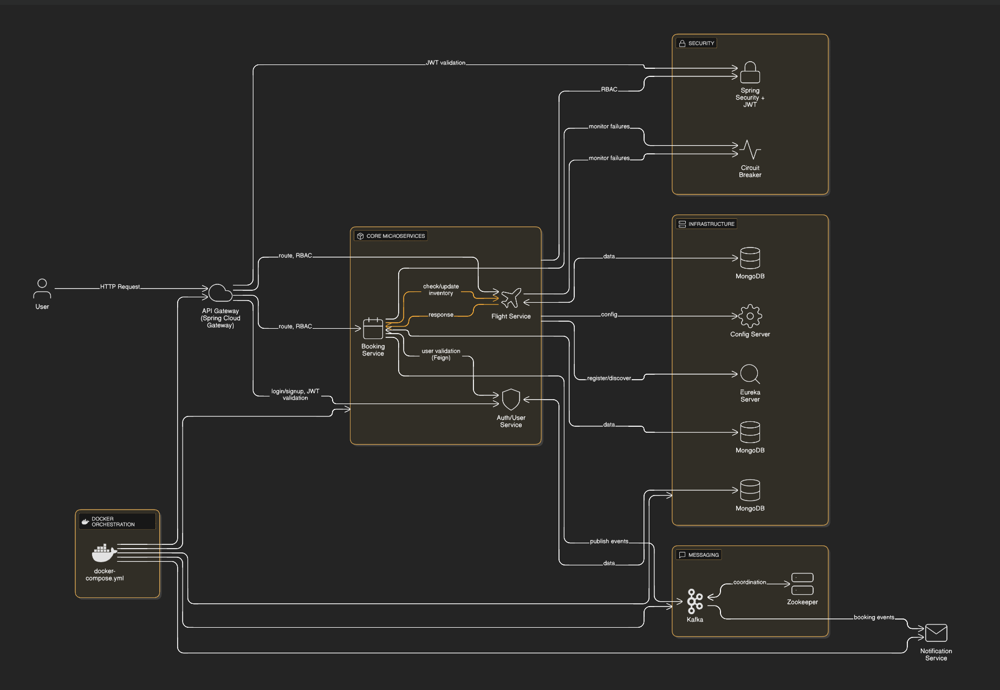

# Flight Booking System – Dockerized Microservices Architecture

This project is a scalable, modular flight booking system built using Spring Boot microservices. It demonstrates centralized authentication, role-based access control (RBAC), service discovery, and inter-service communication using Feign clients and Kafka and Email Service.

---

## Architecture Summary

### Auth/User Service
- Handles login, signup, and JWT issuance.
- Manages user profiles and roles (`ROLE_USER`, `ROLE_ADMIN`).
- Provides endpoints for user lookup and validation.

### API Gateway (Spring Cloud Gateway)
- Validates JWT tokens using a global filter.
- Routes requests to Booking and Flight services.
- Enforces role-based access control.

### Booking Service
- Manages ticket booking, cancellation, and history.
- Stores booking details (PNR, flightId, userIds, seatNumbers, totalAmount).
- Validates users via Feign → Auth Service.
- Calls Flight Service to check/update seats and flight availability.
- Publishes booking events via Kafka.
- Listens to booking events via Kafka.
- Sends email notifications to users.

### Flight Service
- Manages flight inventory and seat availability.
- Restricted to `ROLE_ADMIN` for flight management.
- Exposes endpoints for CRUD operations on flights and seats.

### Kafka Integration
- **Producer** publishes booking events (`BOOKING_CREATED`, `BOOKING_DELETED`)
- **Consumer** listens and sends email notifications via `JavaMailSender`

### Resilience4j, Error Handling & Code Quality

- **Circuit Breaker**: Isolates failures and ensures graceful fallback in case of service downtime.  
- **Global Exception Handling**: Provides consistent validation error responses across all services.  
- **Code Quality**: Enforced with **SonarQube** analysis for coverage, bug detection, and maintainability.

### Security
- JWT-based authentication.
- Role-based access enforced at Gateway and service level.(`ROLE_USER`, `ROLE_ADMIN`)

### Docker & Docker Compose

- **Dockerfiles**: Each microservice (User/Auth, Flight, Booking, Gateway, Config, Eureka) has its own `Dockerfile` for containerization.
- **Docker Compose**: A single `docker-compose.yml` orchestrates all services together, ensuring:
  - Explicit port mapping for each service
  - Centralized environment variables and secrets
  - Dependency management (Config Server → Eureka → Services → Gateway)
  - Kafka + Zookeeper containers for event streaming
  - MongoDB containers for persistence

---

## Infrastructure
- **MongoDB**: Data persistence for Auth, Booking, Flight.
- **Config Server**: Centralized configuration ([Config-Server](https://github.com/Pranitha161/flight-booking-system-jwt-config-server))
- **Eureka Server**: Service discovery.
- **Kafka Broker + Zookeeper**: Event streaming backbone.
- **API Gateway (Spring Cloud Gateway)**: Single entry point for routing requests, JWT validation, and traffic control.
- **Spring Security + JWT**: Authentication and role-based access control (RBAC) enforced across services.

---

## Tech Stack
- **Spring Boot (WebFlux)** – Reactive REST APIs  
- **Spring Cloud Config Server** – centralized configuration  
- **Spring Cloud Gateway** – API Gateway  
- **Spring Security + JWT** – authentication and role-based access control (RBAC)  
- **Resilience4j Circuit Breaker** – fault tolerance  
- **Kafka** – messaging broker for booking events  
- **MongoDB** – persistence layer  
- **Jakarta Validation** – input validation  
- **SonarQube** – static analysis and code quality  
- **Docker + Docker Compose** – containerization and orchestration for all services

---
## System Workflow

